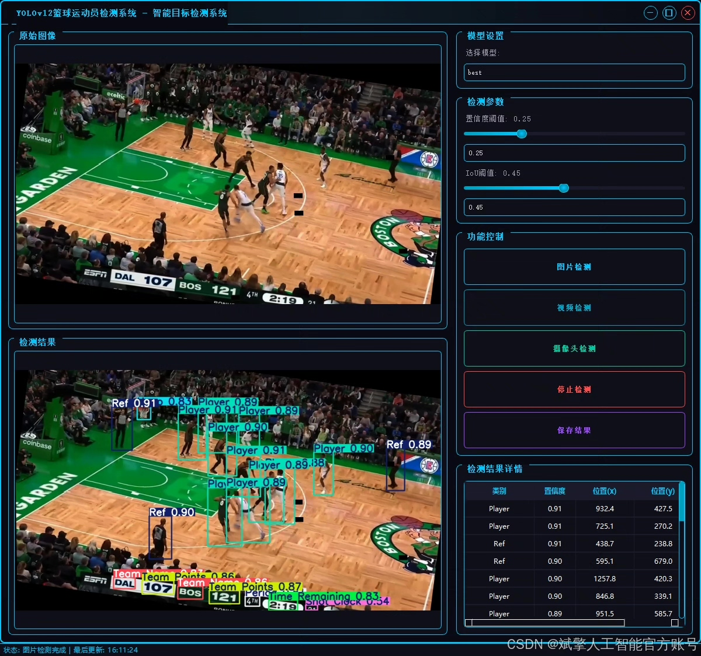
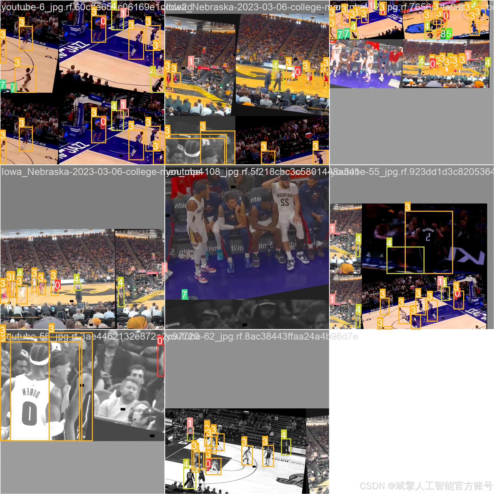
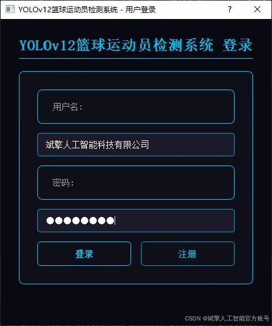
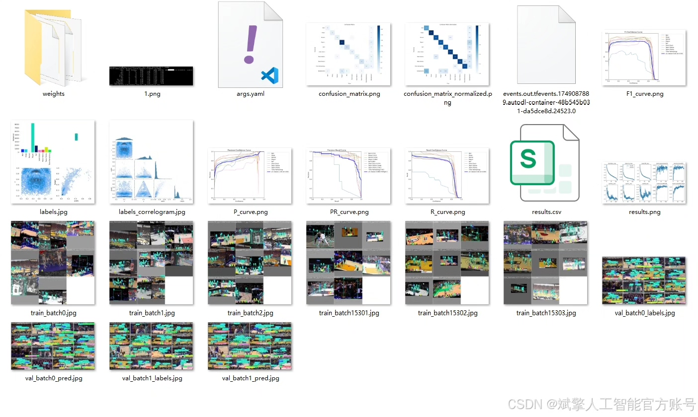
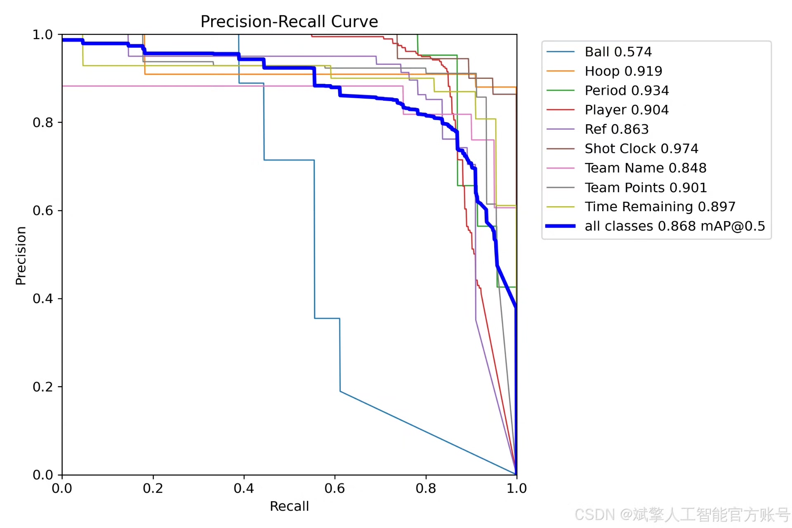
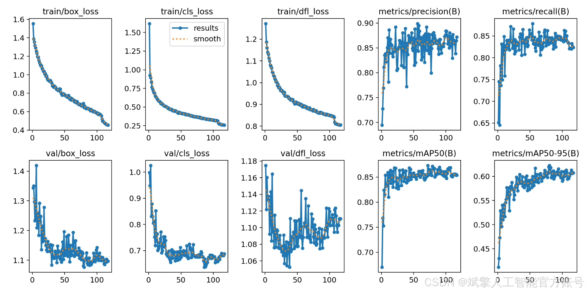
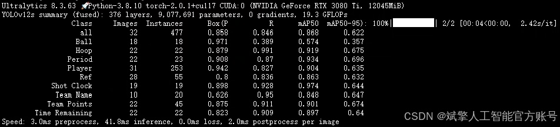
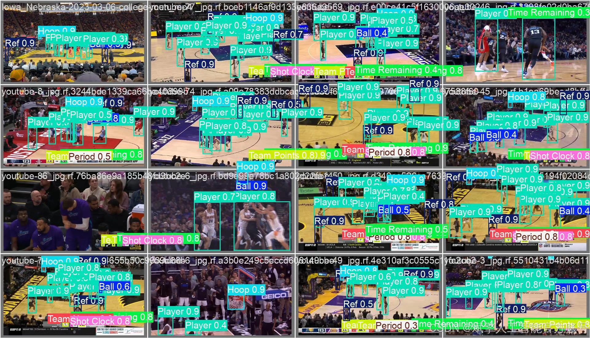

# YOLOv12 Basketball Athlete Detection System

## Body

YOLOv12 Basketball Athlete Detection System Based on Deep Learning YOLOv12: A Basketball Athlete and Key Object Detection System (YOLOv12+YOLO dataset + UI interface + login registration interface + Python project source code + model)

This paper designs and implements a basketball athlete and key object detection system based on the YOLOv12 deep learning framework. The system can accurately recognize nine types of targets in basketball games, including players (Player), basketball (Ball), hoop (Hoop), referee (Ref), shot clock (Shot Clock, Time Remaining), score (Team Points), team name (Team Name), and period (Period). By constructing a custom dataset containing 1,196 images (training set 1,140, validation set 32, test set 24). The system is implemented using the PyTorch framework and integrates a user-friendly UI interface, supporting login registration functions. Experiments show that YOLOv12 achieves high detection accuracy and real-time performance on the test set.

✅ User Login Registration: Supports password verification and security validation.
✅ Three detection modes: Based on the YOLOv12 model, supports image, video, and real-time camera detection, with precise target recognition.
✅ Dual-screen comparison: Displays the original scene and detection results on the same screen.
✅ Data visualization: Real-time table displays the category, confidence, and coordinates of detected targets.
✅ Intelligent parameter adjustment: Offers a confidence slide bar to dynamically optimize detection accuracy, adapting to different scene requirements.
✅ Sci-fi style interaction interface: Dark theme combined with dynamic light effects, reducing visual fatigue and improving operational experience.

## Images

## Payment

Here is a pay link on Stripe ( https://buy.stripe.com/3cs8yP7sY87d0vu9AB ). Please contact me lonlonago@foxmail.com after funding $89, and I will send you a complete data files , thank you!

